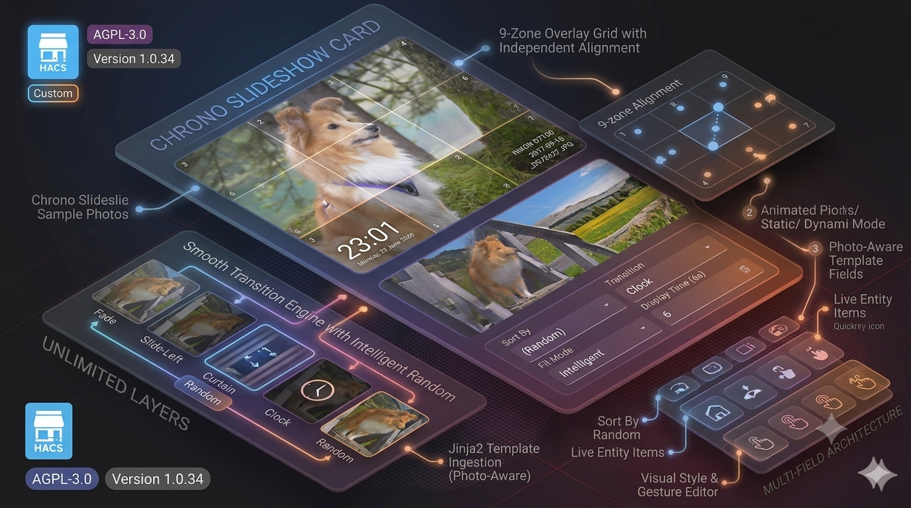

  

  
  
  

  

  

  

    <strong>A photo panel card for Home Assistant dashboards.</strong>
  

---

## ⚖️ License

**GNU Affero General Public License v3.0 (AGPL-3.0)**

This project is licensed under the AGPL-3.0. You are free to use, modify, and distribute this software, provided that any modifications or derivative works that are made available — including over a network — are also distributed under the same license.

Full license text: [https://www.gnu.org/licenses/agpl-3.0](https://www.gnu.org/licenses/agpl-3.0)

Copyright © 2026 Rob Vandenberg. All rights reserved.

---

## ☕ Support

If you find this project useful and wish to support its continued development, please consider a contribution.

