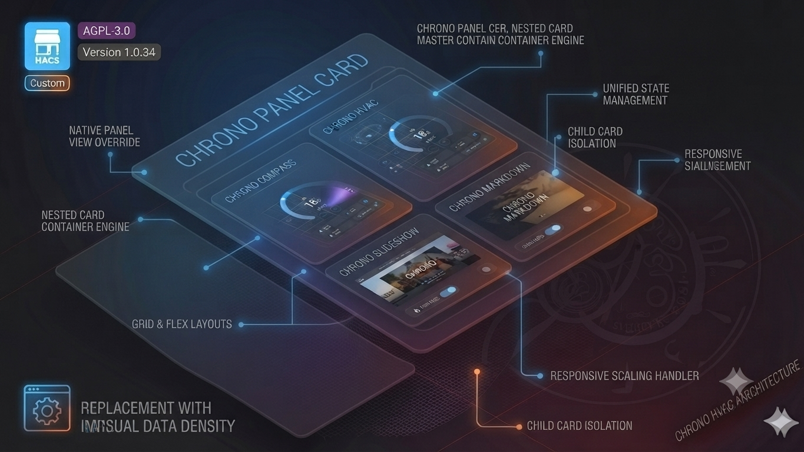

<div align="center">

  [](https://github.com/hacs/integration)
  [](https://www.gnu.org/licenses/agpl-3.0)
  [](https://github.com/rob-vandenberg/chrono-panel-card/releases)

  

  

  <p align="center">
    <strong>A multi-card container for Home Assistant panel views.<br>
            Overcomes the native single-card panel restriction by allowing multiple cards to be nested.<br>
            Features robust child card isolation, visibility condition management, and responsive scaling.</strong>
  </p>

  <p align="center">
    <a href="#introduction">Introduction</a> •
    <a href="#key-features">Key Features</a> •
    <a href="#installation">Installation</a> •
    <a href="#usage">Usage</a> •
    <a href="#license">License</a>
  </p>

</div>

---

**Chrono Panel Card** is a specialized container card designed for Home Assistant panel views. By default, Home Assistant restricts a panel view to containing only a single card. This card solves that limitation by allowing you to place multiple cards inside it, ensuring that child cards behave properly, scale cleanly, and support conditional visibility without leaving empty tracking rows or spaces behind.

---

## 📋 Table of Contents

- [Introduction](#introduction)
- [Key Features](#key-features)
- [Installation](#installation)
  - [HACS (Recommended)](#hacs-recommended)
  - [Manual Installation](#manual-installation)
- [Uninstallation](#uninstallation)
- [Usage](#usage)
  - [Adding the Card](#adding-the-card)
  - [Card Options](#card-options)
  - [Visibility Conditions](#visibility-conditions)
- [Limitations](#limitations)
- [License](#license)
- [Support](#support)

---

## 🚀 Key Features

### 🧩 Multi-Card Container Engine
Bypass the native Home Assistant panel view limitation of one card per view. Nest multiple cards cleanly within a single panel element.

### 👀 Direct Visibility Condition Evaluation
Each nested child card can carry its own visibility block (`state` or `numeric_state` conditions). Evaluated directly by the container to ensure hidden cards take up precisely zero layout space.

### 📐 Responsive Scaling & Layout
Ensures child components adapt and scale accurately within their container boundaries, preventing layout overflows or clipping issues.

### 🎛️ Complete Visual & YAML Editor Support
Easily add, reorder, configure, copy, cut, or delete nested cards using a fully integrated visual UI or raw YAML configuration mode.

---

## 📦 Installation

### HACS (Recommended)

1. Open **HACS** in your Home Assistant instance[cite: 1].
2. Navigate to **Frontend** and click the three-dot menu in the top right corner[cite: 1].
3. Select **Custom repositories**[cite: 1].
4. Enter your repository URL and select **Lovelace** as the category[cite: 1].
5. Click **Add**[cite: 1]. The repository will appear in the list[cite: 1].
6. Search for `Chrono Panel Card` and click **Download**[cite: 1].
7. Reload your browser[cite: 1].

### Manual Installation

1. Download `chrono-panel-card.js` from the [latest release](https://github.com/rob-vandenberg/chrono-panel-card/releases/latest).
2. Copy it to your Home Assistant `config/www/` folder[cite: 1].
3. In Home Assistant, go to **Settings → Dashboards → Resources**[cite: 1].
4. Click **Add Resource**[cite: 1].
5. Enter `/local/chrono-panel-card.js` as the URL and select **JavaScript Module**[cite: 1].
6. Click **Create** and reload your browser[cite: 1].

---

## 🗑️ Uninstallation

### Via HACS
1. Open **HACS → Frontend**[cite: 1].
2. Find **Chrono Panel Card** and click the three-dot menu[cite: 1].
3. Select **Remove**[cite: 1].
4. Reload your browser[cite: 1].

### Manual
1. Delete `chrono-panel-card.js` from `config/www/`[cite: 1].
2. Remove the resource entry from **Settings → Dashboards → Resources**[cite: 1].
3. Remove any cards using `chrono-panel-card` from your dashboards[cite: 1].

---

## ⚙️ Usage

### Adding the Card

1. Open a dashboard and click **Edit Dashboard**[cite: 1].
2. Click **Add Card**[cite: 1].
3. Search for **Chrono Panel Card**[cite: 1].
4. Use the visual editor to add and configure your nested child cards.

If you prefer editing the YAML configuration directly, here is an example containing multiple nested cards:

```yaml
type: custom:chrono-panel-card
cards:
  - type: custom:chrono-markdown-card
    content: "Welcome to my panel dashboard!"
  - type: entities
    entities:
      - light.living_room
      - sensor.indoor_temperature
    visibility:
      - condition: state
        entity: sun.sun
        state: above_horizon
```

---

## ⚖️ License

**GNU Affero General Public License v3.0 (AGPL-3.0)**

This project is licensed under the AGPL-3.0. You are free to use, modify, and distribute this software, provided that any modifications or derivative works that are made available — including over a network — are also distributed under the same license.

Full license text: [https://www.gnu.org/licenses/agpl-3.0](https://www.gnu.org/licenses/agpl-3.0)

Copyright © 2026 Rob Vandenberg. All rights reserved.

---

## ☕ Support

If you find this project useful and wish to support its continued development, please consider a contribution.

[](https://www.buymeacoffee.com/robvandenberg)
